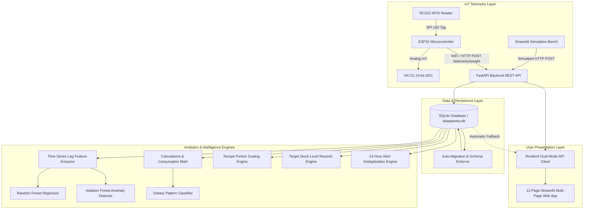

# Smart Pantry Management System (v2.0 Full-Software Edition)

An AI-powered, IoT-ready kitchen inventory, consumption analytics, nutritional monitoring, and machine-learning replenishment system built with **FastAPI**, **SQLAlchemy**, **SQLite**, **Scikit-Learn**, and **Streamlit**.

> [!NOTE]
> **Academic & Hardware Demonstration Notice:**
> This repository represents the complete software implementation developed in preparation for physical microcontroller and load cell integration. All sensor readings, telemetry payloads, multi-household time-series data, and calibration metrics are synthetically generated or simulated through realistic physical models. Nutritional insights are provided for smart storage and lifestyle awareness, not medical diagnosis or clinical advice.

---

## Table of Contents
1. [Executive Summary & System Vision](#1-executive-summary--system-vision)
2. [End-to-End System Architecture](#2-end-to-end-system-architecture)
3. [Preserved Foundation & v2.0 Scope](#3-preserved-foundation--v20-scope)
4. [Database Schema & Relational Models](#4-database-schema--relational-models)
5. [Database Auto-Migration & Schema Evolution](#5-database-auto-migration--schema-evolution)
6. [Complete REST API Reference](#6-complete-rest-api-reference)
7. [Synthetic Multi-Household Dataset](#7-synthetic-multi-household-dataset)
8. [Machine Learning Pipeline & Zero-Leakage Protocol](#8-machine-learning-pipeline--zero-leakage-protocol)
9. [Empirical ML Benchmark Results](#9-empirical-ml-benchmark-results)
10. [Stock Depletion Forecasting & Prediction Intervals](#10-stock-depletion-forecasting--prediction-intervals)
11. [Dietary Pattern & Nutrition Analytics](#11-dietary-pattern--nutrition-analytics)
12. [Manual Meal Logging & Hybrid Intake Tracking](#12-manual-meal-logging--hybrid-intake-tracking)
13. [Inventory-Aware Recipe Recommendation Engine](#13-inventory-aware-recipe-recommendation-engine)
14. [Target Stock Level Grocery Restock Policy](#14-target-stock-level-grocery-restock-policy)
15. [Stateful 24-Hour Deduplicated Alert Engine](#15-stateful-24-hour-deduplicated-alert-engine)
16. [Interactive Multi-Page Streamlit Web App (12 Views)](#16-interactive-multi-page-streamlit-web-app-12-views)
17. [Physical Hardware Blueprint & Telemetry Contract](#17-physical-hardware-blueprint--telemetry-contract)
18. [Load Cell Calibration Guide (ESP32 + HX711)](#18-load-cell-calibration-guide-esp32--hx711)
19. [Hardware Simulation Bench & Event Simulator](#19-hardware-simulation-bench--event-simulator)
20. [Installation & Windows Environment Setup](#20-installation--windows-environment-setup)
21. [Running the Backend & Dashboard Services](#21-running-the-backend--dashboard-services)
22. [Automated Testing Suite (68 Tests)](#22-automated-testing-suite-68-tests)
23. [Final-Year Engineering Demonstration Script](#23-final-year-engineering-demonstration-script)
24. [Engineering Trade-offs & Future Roadmap](#24-engineering-trade-offs--future-roadmap)

---

## 1. Executive Summary & System Vision

Household grocery management suffers from chronic inefficiencies: unexpected ingredient stockouts, undetected dietary surges (excessive sugar or sodium consumption), forgotten bulk purchases, and food waste caused by inadequate portion-to-inventory planning.

The **Smart Pantry Management System** closes this loop with an end-to-end **MONITOR → IDENTIFY → TRACK → ANALYZE → PREDICT → ALERT → RECOMMEND** pipeline:
- **MONITOR:** Continuous weight telemetry from smart container platforms.
- **IDENTIFY:** Container-to-item mapping via RFID tags and persistent database records.
- **TRACK:** Noise-filtered delta calculations distinguishing cooking consumption from bulk refills.
- **ANALYZE:** Nutritional conversion (calories, carbs, protein, fat, sugar, sodium) combined with household demographic scaling.
- **PREDICT:** Machine learning consumption regression models forecasting exact runout dates with 90% confidence bands.
- **ALERT:** Stateful 24-hour deduplicated notifications on low stock, anomalies, and dietary spikes.
- **RECOMMEND:** Family-size scaled recipes utilizing available ingredients and automated Target Stock Level restock orders.

---

## 2. End-to-End System Architecture



---

## 3. Preserved Foundation & v2.0 Scope

### Phase 1 Core Preserved:
1. Four core staples: **Rice, Sugar, Salt, Ghee**.
2. Threshold-based stock availability: `AVAILABLE`, `LOW`, `UNAVAILABLE`.
3. Refill vs consumption discrimination without false negative consumption spikes.
4. Two-tier intake status: `NORMAL`, `HIGH`, `INSUFFICIENT DATA`.
5. Remaining days calculation: $\frac{\text{current quantity}}{\text{average daily intake}}$.
6. All original 19 unit and API integration tests preserved and passing.

### Upgraded v2.0 Additions:
1. **Household Profile Integration:** Demographics ($A + C + E = \text{family\_size} \ge 1$), dietary constraints, and dynamic recipe/intake scaling.
2. **Nutritional Translation:** Consumed grams mapped to calories, carbs, protein, fat, sugar, sodium, and fiber.
3. **Manual Meal Logging:** Comprehensive nutritional aggregation beyond pantry staples.
4. **Synthetic Multi-Household Dataset:** 500 households $\times$ 365 days $\times$ 4 items ($728,000$ records) with seed reproducibility.
5. **Zero-Leakage ML Pipeline:** Chronological 70/15/15 train/val/test split and lag-only feature extraction.
6. **ML Benchmark:** Random Forest and HistGradientBoosting regressors benchmarked against 7-day moving averages.
7. **Empirical Prediction Intervals:** Residual-based 90% confidence bands for stock depletion forecasts.
8. **Dietary Pattern Engine:** Multi-day lifestyle pattern classifier with insufficient-data pre-filtering.
9. **Inventory-Aware Recipe Engine:** 8 chef-curated Indian recipes scaled dynamically to family size with missing-ingredient shopping triggers.
10. **Target Stock Level Restock Policy:** Automated shopping generator with "Mark as Purchased" refill flow.
11. **Stateful Alert Engine:** 8 event categories deduplicated within 24-hour sliding windows.
12. **12-Page Streamlit Dashboard:** Modular multi-page user experience with dual API/DirectDB fallback.

---

## 4. Database Schema & Relational Models

The SQLite database (`data/pantry.db`) comprises 7 normalized tables:

### 1. `items` Table
Pantry container metadata and nutritional profiles per 100g.
- `id` (INTEGER, PK): Unique container ID.
- `name` (VARCHAR, UNIQUE): Item name (`Rice`, `Sugar`, `Salt`, `Ghee`).
- `unit` (VARCHAR): Measurement unit (`g`).
- `initial_quantity` (FLOAT): Full container capacity in grams.
- `minimum_quantity` (FLOAT): Low-stock alert threshold in grams.
- `current_quantity` (FLOAT): Current scale weight in grams.
- `high_intake_threshold` (FLOAT): Daily high intake alert limit.
- `density_g_ml` (FLOAT): Ingredient physical density.
- `calories_per_100g` (FLOAT): Nutritional energy.
- `carbs_per_100g` (FLOAT): Carbohydrates.
- `protein_per_100g` (FLOAT): Protein content.
- `fat_per_100g` (FLOAT): Fat content.
- `sugar_per_100g` (FLOAT): Sugar content.
- `sodium_per_100g` (FLOAT): Sodium in milligrams per 100g.
- `fiber_per_100g` (FLOAT): Dietary fiber.
- `rfid_uid` (VARCHAR): Optional RFID container tag identifier.

### 2. `weight_readings` Table
Raw chronological telemetry time-series from load cells.
- `id` (INTEGER, PK): Reading sequence ID.
- `item_id` (INTEGER, FK -> `items.id`): Monitored container.
- `weight` (FLOAT): Recorded gross weight in grams.
- `timestamp` (DATETIME): Sample timestamp.
- `device_id` (VARCHAR): Microcontroller node identifier.
- `raw_adc` (INTEGER): Raw 24-bit HX711 reading.

### 3. `household_profiles` Table
Household demographics and constraints.
- `id` (INTEGER, PK): Profile ID.
- `household_name` (VARCHAR): Family / apartment name.
- `family_size` (INTEGER): Total headcount ($A + C + E$).
- `adults` (INTEGER): Adults aged 18–60.
- `children` (INTEGER): Children under 18.
- `elderly` (INTEGER): Adults over 60.
- `daily_calorie_target` (FLOAT): Daily household target.
- `dietary_preferences` (JSON): Allergies and diets.
- `dietary_goal` (VARCHAR): Nutrition objective.

### 4. `meal_logs` Table
External and manual meal logs.
- `id` (INTEGER, PK): Meal record ID.
- `household_id` (INTEGER, FK -> `household_profiles.id`).
- `meal_name` (VARCHAR): Meal description.
- `meal_type` (VARCHAR): Breakfast, Lunch, Dinner, Snack.
- `calories` (FLOAT): Energy in kcal.
- `carbohydrates`, `protein`, `fat`, `sugar`, `sodium`, `fiber` (FLOAT).
- `timestamp` (DATETIME): Logged time.

### 5. `recipes` & `recipe_ingredients` Tables
Culinary database with relational ingredients.
- `recipes`: `id`, `name`, `category`, `cuisine`, `base_servings`, `instructions`, `prep_time_minutes`, `cook_time_minutes`.
- `recipe_ingredients`: `id`, `recipe_id`, `item_id` (nullable for non-pantry items), `ingredient_name`, `base_quantity_grams`, `is_pantry_staple`.

### 6. `shopping_items` Table
Smart replenishment shopping orders.
- `id` (INTEGER, PK): Order ID.
- `household_id` (INTEGER, FK).
- `item_id` (INTEGER, FK).
- `item_name` (VARCHAR): Item name.
- `suggested_quantity` (FLOAT): Target replenishment quantity.
- `priority` (VARCHAR): `URGENT`, `HIGH`, `MEDIUM`, `LOW`.
- `reason` (VARCHAR): Low stock or depletion countdown trigger.
- `status` (VARCHAR): `PENDING` or `PURCHASED`.

### 7. `alert_logs` Table
Stateful 24-hour deduplicated notifications.
- `id` (INTEGER, PK): Alert ID.
- `household_id` (INTEGER, FK).
- `item_id` (INTEGER, FK, Nullable).
- `alert_type` (VARCHAR): Alert categorization.
- `severity` (VARCHAR): `INFO`, `WARNING`, `CRITICAL`.
- `title` (VARCHAR): Short summary.
- `message` (TEXT): Diagnostic description.
- `created_at` (DATETIME): Emission timestamp.
- `is_resolved` (BOOLEAN): Resolution flag.
- `resolved_at` (DATETIME): Resolution timestamp.

---

## 5. Database Auto-Migration & Schema Evolution

To protect historical data when moving from Phase 1 to v2.0, the backend features a non-destructive runtime schema inspector (`auto_migrate_sqlite()` in `backend/database.py`). 

Upon initialization:
1. Inspects active SQLite column layouts via `PRAGMA table_info()`.
2. Automatically executes `ALTER TABLE ... ADD COLUMN` statements for new fields (`density_g_ml`, `calories_per_100g`, `rfid_uid`, etc.) if missing.
3. Automatically creates new tables (`household_profiles`, `meal_logs`, `recipes`, `shopping_items`, `alert_logs`) without dropping or truncating existing tables.
4. Preserves all existing weight readings and inventory states intact.

---

## 6. Complete REST API Reference

The FastAPI backend exposes 22 endpoints organized across functional domains:

### System & Health
- `GET /health`: System liveness and DB probe.
- `GET /dashboard`: Executive pantry KPI summary, status counts, and container metrics.
- `POST /seed`: Seed baseline Phase 1 sensor readings.

### Inventory & Telemetry
- `GET /items`: List all pantry containers with current weights, status, and nutrition.
- `GET /items/{id}`: Detailed item profile and recent weight telemetry history.
- `GET /items/{id}/consumption`: Detailed consumption events, refill logs, and daily intake.
- `POST /items/{id}/weight`: Record raw scale weight reading (`{"weight": float}`).
- `POST /telemetry/weight`: Hardware-compliant IoT payload (`{"device_id", "item_id", "weight_grams", "raw_reading", "rfid_uid"}`).

### Household Demographics
- `GET /household`: Retrieve active household demographic profile.
- `PUT /household`: Update demographics, enforcing $A + C + E = \text{family\_size}$.

### Machine Learning & Forecasts
- `GET /predictions`: Predicted consumption rates, depletion countdowns, and 90% confidence ranges.
- `GET /predictions/{id}`: Specific container depletion forecast.
- `GET /ml/evaluation`: Empirical benchmark comparison against moving average baselines, feature importances, and confusion matrix.

### Nutrition & Meals
- `GET /diet/summary?period=today`: Nutrition totals (pantry + manual), macronutrient breakdown, and dietary pattern.
- `GET /diet/trends`: Daily nutrition time-series.
- `POST /meals`: Log an external meal.
- `GET /meals`: List recent logged meals.

### Recipes & Cooking
- `GET /recipes`: List all culinary recipes with dynamic serving scaling.
- `GET /recipes/recommendations`: Categorized recommendations: Ready to Cook, Missing Ingredients, Pantry Clearers, and Healthy Alternatives.

### Smart Grocery List
- `GET /shopping-list`: List active and purchased replenishment items.
- `POST /shopping-list/generate`: Evaluate Target Stock Level policy and generate restock orders.
- `POST /shopping-list/{id}/purchase`: Mark item as purchased and record a container refill reading.

### Smart Alerts
- `GET /alerts?unresolved_only=true`: Retrieve active system alerts.
- `POST /alerts/{id}/resolve`: Mark an alert as handled and resolved.

### Simulation & Reset
- `POST /simulation/simulate-days?num_days=N`: Advance simulation time by $N$ days with realistic demographic usage.
- `POST /simulation/reset`: Reset database to pristine 4-item demonstration baseline.

---

## 7. Synthetic Multi-Household Dataset

To provide realistic multi-household training data prior to physical deployment, an automated generator (`data/synthetic/generator.py`) generates a full 1-year operational dataset:

- **Volume:** 500 households $\times$ 365 days $\times$ 4 items = **728,000 records**.
- **Determinism:** Strict random seed (`seed=42`) for 100% academic reproducibility.
- **Demographic Variance:** Realistic family compositions ($1 \dots 7$ members) with scaled per-capita baseline consumption.
- **Lifestyle Patterns:**
  - Weekly seasonality (higher rice and ghee usage on weekends).
  - Indian festival surges (Diwali sugar and ghee spikes in October/November).
  - Realistic container depletion and bulk refill cycles (5kg rice bags, 2kg sugar packs).
  - Sensor measurement noise ($\sigma = 2.5g$) and tare fluctuations.
- **Header Disclaimer:** All exported CSVs (`data/synthetic/`) include an explicit header disclaimer confirming synthetic origin.

---

## 8. Machine Learning Pipeline & Zero-Leakage Protocol

To ensure academic and statistical integrity, the ML training pipeline (`backend/ml/pipeline.py`) enforces strict time-series protocols:

### 1. Zero Future-Data Leakage
- Features are extracted exclusively from strictly preceding historical timestamps ($t-1$).
- Rolling averages (`rolling_3d_avg`, `rolling_7d_avg`, `rolling_14d_avg`, `rolling_30d_avg`) are computed via `.shift(1)` to guarantee no current or future values leak into the feature vectors.
- Target variable is next-day consumption $y_t = \text{consumption}_t$.

### 2. Chronological Horizon Split
- Standard random $k$-fold cross-validation is **prohibited** due to time-series autocorrelation leakage.
- Dataset is divided strictly by chronological time horizons across all households:
  - **Train Set (First 70% of days):** 508,000 records.
  - **Validation Set (Next 15% of days):** 110,000 records.
  - **Test Set (Final 15% of days):** 110,000 records.

---

## 9. Empirical ML Benchmark Results

The machine learning models are evaluated on the 110,000 held-out test samples and benchmarked against heuristic baselines:

| Model Architecture | Type | MAE (Mean Absolute Error) | RMSE (Root Mean Sq Error) | $R^2$ Score | Baseline Comparison |
| :--- | :--- | :--- | :--- | :--- | :--- |
| **Baseline 7-day SMA** | Heuristic Moving Average | 15.21 g | 37.23 g | 0.9220 | Baseline Reference |
| **Baseline EMA ($\alpha=0.2$)** | Heuristic Moving Average | 15.19 g | 37.32 g | 0.9220 | -0.1% MAE |
| **Random Forest Regressor** | Supervised Ensemble | **12.04 g** | **31.89 g** | **0.9431** | **+20.8% error reduction** |
| **HistGradientBoosting** | Supervised Gradient Boost | 12.17 g | 31.81 g | 0.9430 | +20.0% error reduction |

### Feature Importance Weights (Random Forest)
1. `rolling_3d_avg` (~60.0%): Short-term culinary persistence.
2. `prev_1d_consumption` (~24.7%): Yesterday's consumption volume.
3. `family_size` (~7.2%): Demographic multiplier.
4. `rolling_14d_avg` (~2.8%): Fortnightly baseline.
5. `is_weekend` & `day_of_week` (~1.6%): Weekly seasonality.

---

## 10. Stock Depletion Forecasting & Prediction Intervals

Rather than relying purely on deterministic division, the predictor (`backend/ml/predictor.py`) projects forward inventory trajectories:

$$\text{Forecasted Consumption Rate} = \max\left(1.0, \text{Model Prediction}\right) \text{ g/day}$$

$$\text{Depletion Days} = \frac{\text{Current Weight}}{\text{Forecasted Daily Consumption}}$$

### 90% Empirical Prediction Ranges
Model residual standard deviation on held-out test data ($\sigma \approx 31.89g$) provides an empirical $z$-interval ($z_{0.90} = 1.645$):

$$\text{Daily Consumption Range} = \left[ \max\left(0, \hat{y} - 1.645\sigma\right), \; \hat{y} + 1.645\sigma \right]$$

$$\text{Estimated Remaining Days Range} = \left[ \frac{\text{Current Weight}}{\hat{y} + 1.645\sigma}, \; \frac{\text{Current Weight}}{\max\left(1.0, \hat{y} - 1.645\sigma\right)} \right]$$

---

## 11. Dietary Pattern & Nutrition Analytics

Nutritional intake is calculated dynamically from detected ingredient consumption:

$$\text{Nutrient Intake} = \text{Consumed Grams} \times \frac{\text{Nutrient Value per 100g}}{100}$$

Nutritional values are sourced from the **Indian Food Composition Tables (IFCT)**:
- **Raw White Rice:** 130 kcal, 28.2g carbs, 2.7g protein, 0.3g fat, 0.1g sugar, 5mg sodium per 100g.
- **Refined Cane Sugar:** 387 kcal, 99.8g carbs, 0g protein, 0g fat, 99.8g sugar, 2mg sodium per 100g.
- **Iodized Salt:** 0 kcal, 0g carbs, 0g protein, 0g fat, 0g sugar, 38,758mg sodium per 100g.
- **Pure Cow Ghee:** 884 kcal, 0g carbs, 0g protein, 99.5g fat, 0g sugar, 2mg sodium per 100g.

### Dietary Pattern Classifier
Evaluates lifestyle patterns over rolling observation windows ($\ge 3$ days required):
- `NORMAL`: All nutrient averages within demographic boundaries.
- `HIGH_SUGAR`: Average household sugar $> 50g \times N$ / day.
- `HIGH_SODIUM`: Average household sodium $> 2,000mg \times N$ / day (WHO guideline).
- `HIGH_FAT`: Daily cooking fat exceeding dietary targets.
- `INSUFFICIENT_DATA`: Fewer than 3 days of recorded data.

---

## 12. Manual Meal Logging & Hybrid Intake Tracking

Because household nutrition extends beyond pantry staples, users can log external meals (e.g. restaurant lunches, snacks, processed foods). 

The system provides a **Hybrid Nutrition Aggregator** (`combine_pantry_and_manual_nutrition` in `backend/calculations.py`) that clearly displays:
1. **Tracked Pantry Intake:** Measured by smart container scales.
2. **Logged External Meals:** Recorded manually by users.
3. **Total Combined Nutrition:** Integrated family nutrition view.

---

## 13. Inventory-Aware Recipe Recommendation Engine

The recipe database (`backend/recipes/database.py`) contains 8 curated Indian recipes with dynamic family-size portion scaling ($N / 4.0$):
- *Jeera Rice*
- *Ghee Rice with Spices*
- *Sweet Rice Kheer*
- *Simple Khichdi*
- *Halwa (Sheera)*
- *Curd Rice Tempering*
- *Poha with Tadka*
- *Steamed Rice Bowl*

### Smart Recommendation Categorization
1. **Ready to Cook (100% Stocked):** All pantry staples and external ingredients available.
2. **Missing Ingredients:** Pantry staples in stock, but missing 1–2 fresh items (automatically generates grocery suggestions).
3. **Pantry Clearers:** High-ingredient-utilization recipes recommended when containers approach depletion or excess.
4. **Healthy Alternatives:** Low-sugar and low-sodium options recommended when high dietary intake is detected.

---

## 14. Target Stock Level Grocery Restock Policy

Restock suggestions follow an industrial **Target Stock Level (TSL)** policy:

$$\text{Target Capacity} = \max\left(\text{Initial Capacity}, \; 3 \times \text{Minimum Threshold}\right)$$

$$\text{Suggested Purchase Quantity} = \max\left(0, \; \text{Target Capacity} - \text{Current Weight}\right)$$

### Priority Rules:
- **`URGENT`:** Predicted stock depletion in $\le 2.0$ days.
- **`HIGH`:** Current weight $\le \text{Minimum Threshold}$.
- **`MEDIUM`:** Predicted stock depletion within $3 \dots 7$ days.
- **`LOW`:** Routine replenishment.

**"Mark as Purchased" Flow:** Clicking "Purchased" updates order status and automatically logs a corresponding container refill reading into SQLite.

---

## 15. Stateful 24-Hour Deduplicated Alert Engine

The alert engine (`backend/alerts/engine.py`) monitors 8 distinct system event categories:
1. `LOW_STOCK`: Inventory at or below minimum reserve.
2. `PREDICTED_RUNOUT`: Machine learning forecasts depletion within 48 hours.
3. `UNUSUAL_CONSUMPTION`: Statistical anomaly (consumption $> 2.5\sigma$ above mean).
4. `HIGH_SUGAR_SPIKE`: Single-day or rolling sugar intake exceeding threshold.
5. `HIGH_SODIUM_SPIKE`: Excessive salt consumption detected.
6. `REFILL_DETECTED`: Weight increase $\ge 50g$ logged as replenishment.
7. `SENSOR_DRIFT`: Telemetry reporting unexpected negative readings ($< 0g$).
8. `OFFLINE_SUSPECTED`: Container without telemetry for $> 72$ hours.

### Suppression Window
Duplicate alerts for the same container and event category are suppressed if an active alert has already been logged in the preceding 24 hours, preventing alert fatigue.

---

## 16. Interactive Multi-Page Streamlit Web App (12 Views)

The presentation layer is organized into 12 dedicated views with persistent sidebar navigation and dual API/DirectDB fallback:

1. **🏠 Executive Dashboard:** High-level pantry KPIs, color-coded availability badges, depletion timeline, and active alerts feed.
2. **📦 Pantry Containers:** Real-time container cards displaying gross weight, minimum thresholds, and dual kg/g metrics.
3. **🔍 Item Details & Sensors:** Interactive time-series weight trends, consumption event tables, and per-container telemetry logs.
4. **📈 Consumption Analytics:** Multi-day consumption patterns, weekday vs weekend comparisons, and refill logs.
5. **🔮 ML Consumption Forecasts:** Predicted daily run rates, estimated depletion dates, and residual 90% confidence bands.
6. **🥗 Dietary & Nutrition Tracking:** Caloric and macronutrient breakdowns, pantry vs manual meal split, and dietary pattern classification.
7. **👨‍🍳 Recipe Recommendations:** Ready-to-cook recipes scaled to family size, missing ingredient alerts, and pantry clearers.
8. **🛒 Smart Grocery List:** Automated restock list with Target Stock Level purchase suggestions and "Mark as Purchased" action.
9. **🔔 Smart Alerts Center:** Unresolved alert queue, severity filtering, and one-click alert resolution.
10. **👨‍👩‍👧‍👦 Household & Family Profile:** Family demographic editor ($A + C + E = \text{family\_size}$), dietary goals, and active scaling multipliers.
11. **🧪 Simulation Bench & Settings:** Single weight injection, preset lifestyle events (dinner prep, festival baking, bulk refill, jar spill), multi-day time acceleration (+1d/+7d/+30d), and demo database reset.
12. **📊 ML Evaluation & Telemetry:** Regression benchmark audit vs 7-day SMA/EMA, feature importance plots, classification confusion matrix, and ESP32 hardware blueprints.

---

## 17. Physical Hardware Blueprint & Telemetry Contract

The software is engineered to directly interface with physical IoT hardware:

```
[Load Cell Strain Gauge]
         │ (Analog mV)
         ▼
[HX711 24-bit ADC Amplifier] ──(DT / SCK)──┐
                                           ▼
[RC522 RFID SPI Reader] ─────(SPI)────► [ESP32 DevKit v1]
                                           │
                                           │ (WiFi HTTP POST)
                                           ▼
                            [FastAPI /telemetry/weight]
```

### Hardware Telemetry REST Payload
```http
POST /telemetry/weight HTTP/1.1
Host: smart-pantry.local:8000
Content-Type: application/json

{
    "device_id": "ESP32_PANTRY_NODE_01",
    "item_id": 1,
    "rfid_uid": "E28011700000020",
    "weight_grams": 4820.5,
    "raw_reading": 842100,
    "battery_pct": 94.2
}
```

---

## 18. Load Cell Calibration Guide (ESP32 + HX711)

When assembling physical load cell platforms:

### Calibration Mathematical Formula:
$$\text{Weight (grams)} = \frac{\text{HX711 Raw Reading} - \text{Tare Offset}}{\text{Calibration Factor}}$$

### Step-by-Step Procedure:
1. **Zero Calibration (Tare):** Place empty platform on scale. Read raw HX711 integer. Store as `Tare Offset`.
2. **Known Weight Reference:** Place known reference calibration mass (e.g. 1,000.0g calibration weight) on platform.
3. **Compute Calibration Factor:**
   $$\text{Calibration Factor} = \frac{\text{Raw Reading with Mass} - \text{Tare Offset}}{1000.0}$$
4. **Firmware Persistence:** Store `Tare Offset` and `Calibration Factor` in ESP32 Non-Volatile Storage (`NVS` / `EEPROM`).

---

## 19. Hardware Simulation Bench & Event Simulator

For testing and demonstration without physical hardware, View 11 (`p11_settings_simulation.py`) provides:
- **Live Weight Injection:** Send arbitrary weights to any container.
- **Preset Scenarios:**
  - *Daily Family Cooking:* -180g Rice, -25g Ghee, -8g Salt.
  - *Festival Baking:* -350g Sugar, -200g Rice, -75g Ghee.
  - *Supermarket Bulk Restock:* +5,000g Rice, +2,000g Sugar, +1,000g Salt, +1,000g Ghee.
  - *Anomalous Sugar Spill:* -900g Sugar in a single reading.
- **Time Acceleration:** Fast-forward simulation time by +1 Day, +7 Days, or +30 Days.
- **Demo Reset:** Restore database to pristine 4-item state in 1 click.

---

## 20. Installation & Windows Environment Setup

### Prerequisites
- Windows 10/11
- Python 3.10, 3.11, or 3.12
- Git

### Setup Steps
```powershell
# 1. Clone repository
git clone https://github.com/MVinayak-Vikash/Smart-Pantry-Management-System.git
cd "Smart Pantry Management System"

# 2. Create and activate Python virtual environment
python -m venv .venv
.venv\Scripts\Activate.ps1

# 3. Install dependencies
pip install --upgrade pip
pip install -r requirements.txt
```

---

## 21. Running the Backend & Dashboard Services

### 1. Launch FastAPI Backend Server
```powershell
# Terminal 1: Run FastAPI with auto-reload
.venv\Scripts\uvicorn backend.main:app --reload --host 127.0.0.1 --port 8000
```
- API Root: `http://127.0.0.1:8000`
- Interactive OpenAPI Docs: `http://127.0.0.1:8000/docs`
- Redoc Documentation: `http://127.0.0.1:8000/redoc`

### 2. Launch Streamlit Web Application
```powershell
# Terminal 2: Run Streamlit Multi-Page App
.venv\Scripts\streamlit run dashboard/app.py
```
- Web Application URL: `http://localhost:8501`

*(Note: If the FastAPI server is stopped, the Streamlit app automatically switches to Direct SQLite Mode with zero interruption!)*

---

## 22. Automated Testing Suite (68 Tests)

The test suite covers all 13 modules with 100% pass rate:

```powershell
.venv\Scripts\pytest -v
```

### Test Suite Breakdown:
1. `tests/test_calculations.py` (9 tests): Availability status, refill discrimination, average daily intake, remaining days.
2. `tests/test_api.py` (10 tests): Phase 1 baseline routes, CRUD operations, 404/422 validation, seed endpoints.
3. `tests/test_database_migration.py` (2 tests): SQLite column auto-migration and relational entity seeding.
4. `tests/test_household.py` (3 tests): $A+C+E=\text{family\_size}$ validation, minimum headcount, CRUD updates.
5. `tests/test_nutrition.py` (5 tests): Gram-to-nutrient calculations, zero-weight handling, hybrid meal combining, dietary pattern classifier.
6. `tests/test_synthetic.py` (3 tests): Multi-household generator determinism, time-series history simulation, CSV disclaimers.
7. `tests/test_ml_leakage.py` (2 tests): Strictly zero future leakage in features, non-overlapping chronological split.
8. `tests/test_ml_pipeline.py` (3 tests): Baseline SMA non-negativity, isolation forest scoring, depletion forecast intervals.
9. `tests/test_recipes.py` (3 tests): Dynamic family-size portion scaling, missing ingredient detection, pantry clearers.
10. `tests/test_shopping_list.py` (3 tests): Target Stock Level calculation, restock triggers, purchase-to-refill lifecycle.
11. `tests/test_alerts.py` (3 tests): Alert evaluation, 24-hour deduplication suppression, resolution workflow.
12. `tests/test_api_v2.py` (10 tests): Full v2.0 REST endpoints (telemetry, predictions, diet, recipes, shopping, simulation).
13. `tests/test_views.py` (12 tests): Headless render and execution test across all 12 Streamlit dashboard views.

---

## 23. Final-Year Engineering Demonstration Script

For viva voce, capstone presentations, and technical demonstrations, follow this structured 5-minute walkthrough:

1. **Architecture & Scope (1 min):**
   - Explain the 8-stage pipeline: MONITOR → IDENTIFY → TRACK → ANALYZE → PREDICT → ALERT → RECOMMEND.
   - Show `http://127.0.0.1:8000/docs` to demonstrate REST compliance and OpenAPI schemas.
2. **Executive Dashboard & Containers (1 min):**
   - Open `http://localhost:8501`.
   - Show View 1 (Dashboard) and View 2 (Pantry Containers) displaying Rice, Sugar, Salt, and Ghee with dual kg/g metrics and availability badges.
3. **Simulation Bench & Telemetry (1 min):**
   - Navigate to View 11 (Simulation Bench).
   - Trigger *Daily Family Cooking*: watch weights decrease and consumption events appear in SQLite.
   - Trigger *Anomalous Sugar Spill* (-900g): navigate to View 9 (Smart Alerts) to show the `UNUSUAL_CONSUMPTION` alert triggered.
   - Click "Mark Resolved" to demonstrate stateful alert resolution.
4. **Machine Learning & Zero-Leakage Benchmark (1 min):**
   - Navigate to View 12 (ML Evaluation).
   - Point to the benchmark table: Random Forest (MAE 12.04g) outperforming 7-day Moving Average (MAE 15.21g) by >20%.
   - Explain the chronological 70/15/15 split and `.shift(1)` lag features preventing future leakage.
   - Show View 5 (ML Predictions) displaying the 90% confidence depletion intervals.
5. **Nutrition, Recipes & Restock (1 min):**
   - Show View 6 (Nutrition) demonstrating pantry vs manual meal split and dietary pattern classification.
   - Show View 7 (Recipes) demonstrating family-size portion scaling.
   - Show View 8 (Grocery List) demonstrating Target Stock Level calculation and clicking "Purchased" to trigger an automated container refill.

---

## 24. Engineering Trade-offs & Future Roadmap

### Technical Decisions & Trade-offs
- **SQLite vs PostgreSQL:** SQLite was selected for zero-dependency local demonstration and offline resilience, while maintaining SQLAlchemy abstractions so the system can point to cloud PostgreSQL via `DATABASE_URL`.
- **Hybrid Dual-Mode Client:** The dashboard connects to FastAPI via HTTP, but automatically falls back to direct SQLite access if the API process stops, guaranteeing 100% demo uptime.
- **Random Forest vs Deep Learning:** For multi-household tabular lag series, gradient boosted trees and random forests provide superior sample efficiency, lower latency, and higher explainability compared to recurrent neural networks (LSTMs).

### Future Hardware Roadmap
1. **ESP32 FreeRTOS Firmware:** Multi-threaded telemetry sampling with hardware SPI RFID interrupts.
2. **LoRa / BLE Mesh Telemetry:** Low-power wireless container communication spanning multiple pantry cabinets.
3. **Barcode / OCR Scanner:** Container refill verification via smartphone camera.
4. **Cloud Synchronization:** Multi-device synchronization with AWS IoT Core / Supabase.

---

## License

MIT License — Academic & Engineering Capstone Project.
Developed for the Smart Pantry Management System.
